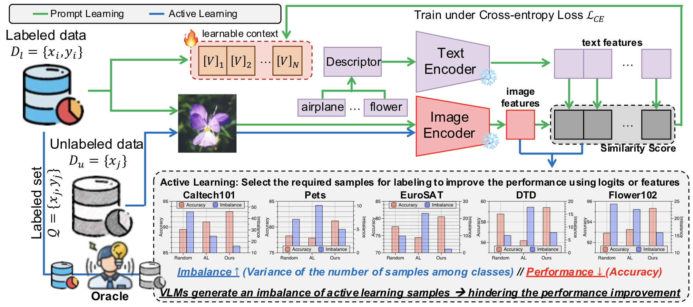

# Active Prompt Learning in Visual Language Models 
## <center> [](https://arxiv.org/abs/2311.11178)  [](https://www.youtube.com/watch?v=JHC9zaDYf5o&ab_channel=%08ZipCookResearcher)  [](https://juleskreuer.eu/citation-badge/) [](https://opensource.org/licenses/MIT)
This repository is the official PyTorch implementation of the following paper. 
 
> **Active Prompt Learning in Visual Language Models** <br>
>Jihwan Bang, Sumyeong Ahn, Jae-Gil Lee <br>
>CVPR 2024 <br>




## Updates

- **[Jun.17th.2024]** First release the code. 

## How to Install
This code is built on the [CoOp repository](https://github.com/KaiyangZhou/CoOp) and it built on top of the awesome toolbox [Dassl.pytorch](https://github.com/KaiyangZhou/Dassl.pytorch). For simply usage, I add the `dassl` directory into our directory, and revise `requirements.txt` to run the code. Hence, you should follow below commands: 
``` bash
conda create -n pcb python=3.10 
conda activate pcb 
cd pcb 
pip install -r requirements.txt 
```

Next, you should build on the datasets - follow [DATASETS.md](DATASETS.md) to install the datasets. 

## How to Run
To run the code, you need to look into `scripts/alvlm/main.sh`. In this file, you must set parameter `DATA` as the directory path that datasets are stored. After then, you can run the code by following command. 
```bash
CUDA_VISIBLE_DEVICES=XX sh scripts/alvlm/main.sh [DATASET NAME] [MODEL NAME] [AL METHOD] [SEED NUMBER] [MODE] 
```
- **DATASET NAME** $\in$ [oxford_flowers, dtd, oxford_pets, caltech101, stanford_cars, eurosat, fgvc_aircraft]
- **MODEL NAME** $\in$ [RN50, RN101, vit_b32, vit_b16]
- **AL METHOD** $\in$ [random, entropy, coreset, badge]
- **SEED**: integer 
- **MODE**: This is for description augmentation $\in$ [none, AS, AE]


## Citation
If you use this code in your research, please kindly cite the following papers

```bash
@inproceedings{bang2024active,
  title={Active Prompt Learning in Vision Language Models},
  author={Bang, Jihwan and Ahn, Sumyeong and Lee, Jae-Gil},
  booktitle={Proceedings of the IEEE/CVF Conference on Computer Vision and Pattern Recognition},
  pages={27004--27014},
  year={2024}
}
```
